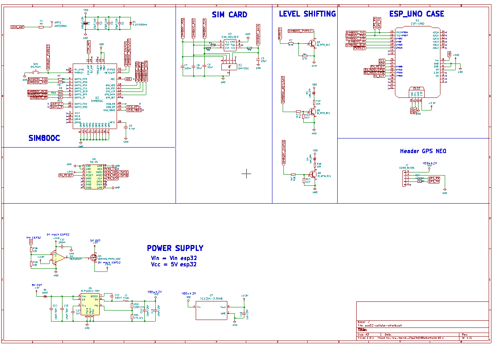
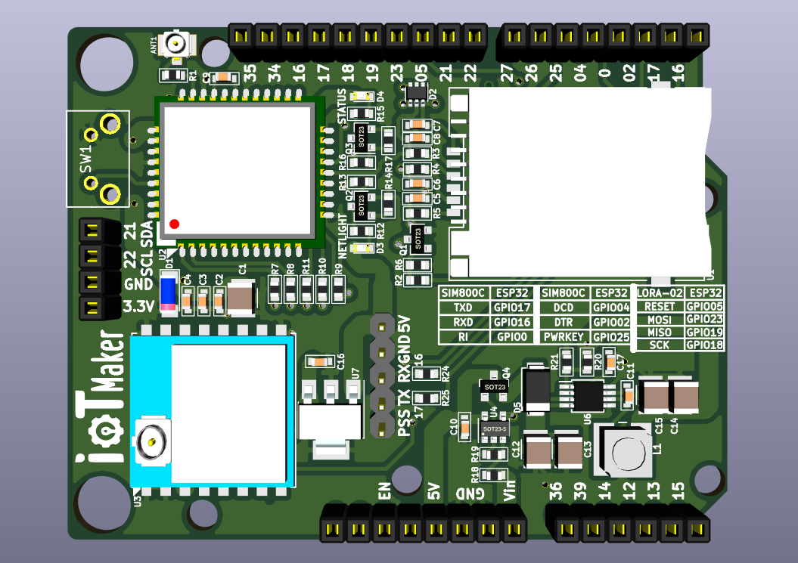
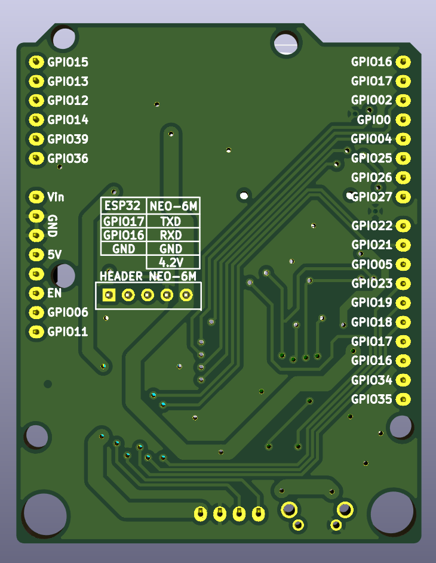

# esp32-cellular-shield
dev: sangseu
- GSM/GPRS : SIM800C

- LORA	 : lora-Ra02

- OLED	 : giống với esp32-wifi-uno

- Nguồn 4.1v : MCP16311, L =Vout/K (K=0.22 V/uH) 
- Nguồn 3.3v : TC1264 (TO-220)

### Schematic

### PCB

### 3D

#### TOP

#### DOWN

